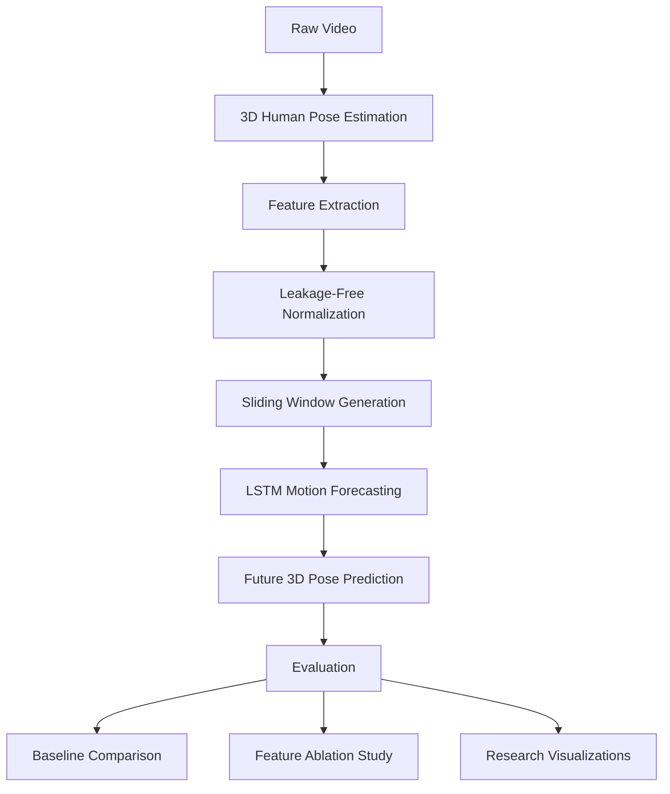
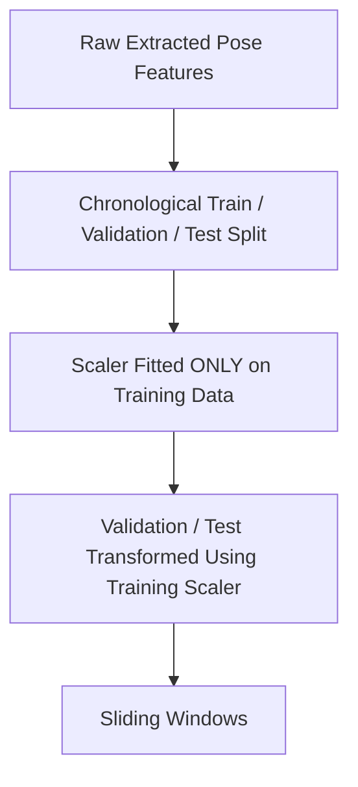
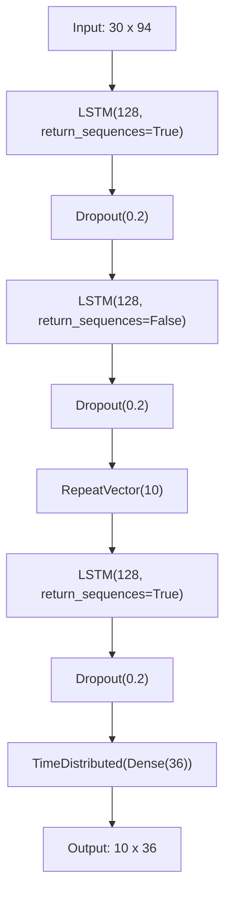

# 3D Human Pose Estimation and Motion Forecasting Using Kinematic Features

**A research investigation into short-horizon 3D human pose forecasting from monocular video, combining estimated pose landmarks with engineered kinematic features.**


---

## Introduction

Estimating human pose from a single video frame provides a static, instantaneous description of body configuration but does not, by itself, characterize how that configuration will evolve. Human motion is inherently temporal: the position of a joint at time *t* is statistically dependent on its recent trajectory, velocity, and acceleration. This project addresses the problem of **short-horizon 3D human motion forecasting** — predicting future 3D joint positions from a window of previously observed poses.

The approach taken here combines raw 3D pose coordinates, obtained from a monocular pose estimation system, with a set of engineered kinematic features (inter-joint distances, joint angles, and first/second-order temporal derivatives of joint position). These features are used as the model's *input* representation, while the forecasting *target* remains the raw future 3D coordinates of a defined set of body landmarks.

This leads to the central research question investigated in this repository:

> **Does enriching a pose-forecasting model's input with engineered geometric and kinematic features improve its ability to predict future 3D human pose, relative to a persistence baseline and to more minimal input representations?**

The remainder of this document describes the pipeline, data handling procedure, model architecture, evaluation protocol, and experimental methodology used to investigate this question.

---

## Table of Contents

1. [Pipeline Overview](#pipeline-overview)
2. [Problem Formulation](#problem-formulation)
3. [3D Pose Estimation](#3d-pose-estimation)
4. [Feature Engineering](#feature-engineering)
5. [Data Preprocessing and Leakage Prevention](#data-preprocessing-and-leakage-prevention)
6. [Sequence Generation](#sequence-generation)
7. [Model Architecture](#model-architecture)
8. [Evaluation Metrics](#evaluation-metrics)
9. [Baseline](#baseline)
10. [Ablation Study](#ablation-study)
11. [Research Questions](#research-questions)
12. [Repository Structure](#repository-structure)
13. [How to Run](#how-to-run)
14. [Results](#results)
15. [Visual Results](#visual-results)
16. [Limitations](#limitations)
17. [Reproducibility](#reproducibility)
18. [Technology Stack](#technology-stack)
19. [Future Work](#future-work)
20. [Project Status](#project-status)
21. [Citation](#citation)
22. [License](#license)

---

## Pipeline Overview



The pipeline proceeds from raw video through 3D pose estimation, feature engineering, normalization, sequence construction, model training, prediction, and finally quantitative and qualitative evaluation, including comparison against a non-learning baseline and a feature ablation study.

---

## Problem Formulation

The forecasting task is formulated as a sequence-to-sequence regression problem:

**Input:** 30 observed frames × 94 features per frame
**Output:** 10 future frames × 36 target values per frame

The 36 output values correspond to **12 landmarks × 3 coordinates (X, Y, Z)**.

### Why future coordinates are the primary prediction target

The forecasting target is deliberately kept as raw future 3D joint coordinates rather than any derived kinematic quantity (velocity, acceleration, angle, etc.), for the following reasons:

- **Coordinates are the ground unit of pose representation.** Distances, angles, velocities, and accelerations are all *derived* from coordinate sequences; predicting coordinates directly avoids compounding the model's task with an additional, non-invertible mapping back to spatial position.
- **Downstream usability.** A predicted set of 3D coordinates can be directly visualized, compared against ground truth via standard pose-forecasting metrics (e.g., MPJPE), and used to reconstruct any of the derived kinematic quantities post hoc, if desired.
- **Consistency with the pose-forecasting literature.** Most published pose-forecasting formulations predict joint positions (or joint angles in a fixed skeletal parameterization) rather than velocity/acceleration fields, since coordinate-space error is the standard basis for reported forecasting metrics such as MPJPE, ADE, and FDE.

The engineered kinematic features (distances, angles, linear and angular velocity/acceleration) are used strictly as **auxiliary input information** — additional descriptors of the motion state at each observed frame — not as prediction targets. The ablation study (see below) is specifically designed to test whether including this auxiliary information improves the model's ability to predict future coordinates.

---

## 3D Pose Estimation

3D pose landmarks are obtained using **MediaPipe Pose World Landmarks**, applied to each frame of the input video.

It is important to be precise about the nature of this data: MediaPipe Pose World Landmarks are **estimated 3D coordinates produced by a monocular pose estimation model**, not measurements from a calibrated multi-camera motion-capture system. They should not be described or treated as metric ground-truth motion capture data. Estimation error, depth ambiguity inherent to monocular input, and per-frame jitter are expected characteristics of this data source and are discussed further in [Limitations](#limitations).

---

## Feature Engineering

The following feature groups are computed from the estimated 3D pose landmarks at each frame:

| Feature Group | Description |
|---|---|
| 3D Pose Coordinates | Raw (X, Y, Z) position of each tracked landmark |
| Distance Features | Euclidean distances between selected pairs of landmarks |
| 3D Joint Angles | Angles formed by selected landmark triplets in 3D space |
| Linear Velocity | Frame-to-frame first derivative of landmark position |
| Linear Acceleration | Frame-to-frame second derivative of landmark position |
| Angular Velocity | Frame-to-frame first derivative of joint angle |
| Angular Acceleration | Frame-to-frame second derivative of joint angle |

Together, these feature groups form the 94-dimensional per-frame input representation used by the full model. The [Ablation Study](#ablation-study) section describes how subsets of these groups are used to isolate their individual contribution.

---

## Data Preprocessing and Leakage Prevention



The data preprocessing procedure is designed explicitly to prevent temporal leakage between the training, validation, and test partitions:

1. **Chronological splitting.** The extracted per-frame feature sequence is split into training, validation, and test segments in chronological order (not randomly shuffled), so that no future frame is used to inform a model evaluated on earlier frames.
2. **Scaler fit only on training data.** The feature normalization scaler (e.g., standardization/min-max scaling) is fit exclusively on the training partition.
3. **Transform-only application to validation/test.** The validation and test partitions are transformed using the parameters learned from the training data only; the scaler is never re-fit or updated using validation or test data.
4. **Sliding windows generated after normalization**, so that window construction does not cross partition boundaries in a way that would leak future information into training windows.

This project does not use a database; all data is handled as extracted feature arrays (e.g., NumPy arrays) persisted to disk.

---

## Sequence Generation

Sequences are constructed using an overlapping sliding window over the normalized, chronologically ordered per-frame feature sequence:

- **Input window length:** 30 frames
- **Prediction horizon:** 10 frames

For example:

```
Frames 1–30   → predict frames 31–40
Frames 2–31   → predict frames 32–41
Frames 3–32   → predict frames 33–42
...
```

Overlapping windows are used because they substantially increase the number of training sequences obtainable from a limited amount of source video, while preserving the local temporal structure required for a model to learn short-horizon motion dynamics. Each window shares most of its frames with its neighbors, so the resulting training set emphasizes the underlying continuous dynamics of the motion rather than a small number of disjoint, unrelated segments.

---

## Model Architecture

The forecasting model is an **LSTM encoder–decoder**:



**Encoder:**
- `LSTM(128, return_sequences=True)` → `Dropout(0.2)`
- `LSTM(128, return_sequences=False)` → `Dropout(0.2)`

**Bridge:**
- `RepeatVector(10)`

**Decoder:**
- `LSTM(128, return_sequences=True)` → `Dropout(0.2)`
- `TimeDistributed(Dense(36))`

**Training configuration:**

| Component | Setting |
|---|---|
| Optimizer | Adam |
| Learning rate | 0.001 |
| Loss function | Mean Squared Error (MSE) |
| Monitored metric | Mean Absolute Error (MAE) |
| Early stopping | Enabled |
| Model checkpointing | Best-model checkpointing enabled |

This is the architecture currently implemented in the repository; no additional architectural variants are implemented at this stage.

---

## Evaluation Metrics

The model is evaluated using the following metrics, computed between predicted and ground-truth future 3D coordinates:

| Metric | Full Name | Definition |
|---|---|---|
| MAE | Mean Absolute Error | $\frac{1}{N}\sum_{i=1}^{N} \lvert y_i - \hat{y}_i \rvert$ |
| MSE | Mean Squared Error | $\frac{1}{N}\sum_{i=1}^{N} (y_i - \hat{y}_i)^2$ |
| RMSE | Root Mean Squared Error | $\sqrt{\frac{1}{N}\sum_{i=1}^{N} (y_i - \hat{y}_i)^2}$ |
| MPJPE | Mean Per Joint Position Error | $\frac{1}{J}\sum_{j=1}^{J} \lVert p_j - \hat{p}_j \rVert_2$ |
| ADE | Average Displacement Error | $\frac{1}{T}\sum_{t=1}^{T} \lVert p_t - \hat{p}_t \rVert_2$ |
| FDE | Final Displacement Error | $\lVert p_T - \hat{p}_T \rVert_2$ |

Where $y_i / \hat{y}_i$ denote ground-truth/predicted scalar values, $p_j / \hat{p}_j$ denote the 3D position of joint $j$, $J$ is the number of joints, $T$ is the prediction horizon (10 frames), and $p_T / \hat{p}_T$ denotes the final predicted frame in the horizon.

**Why MPJPE is particularly relevant here:** MPJPE evaluates error per joint in 3D Euclidean space rather than as an aggregate scalar over flattened coordinate dimensions. Because the forecasting target is structured as a set of 12 3D landmarks, MPJPE gives a per-joint, geometrically interpretable error measure that is standard in the pose estimation and pose-forecasting literature, and is more directly interpretable in physical (e.g., normalized-unit) terms than a coordinate-wise MSE/MAE alone. ADE and FDE further characterize error across the prediction horizon: ADE captures average trajectory accuracy over all 10 predicted frames, while FDE isolates the model's accuracy at the furthest, and typically hardest, prediction step.

---

## Baseline

A non-learning **"Last Observed Pose"** baseline is included in the evaluation pipeline. This baseline repeats the last observed frame's pose for all 10 future prediction steps, producing a constant (non-moving) forecast.

This baseline is included because any learned forecasting model should be expected to outperform a trivial persistence-based prediction strategy; if it does not, this is informative evidence that the learned model is not capturing meaningful motion dynamics beyond what is already present in the most recent observed frame. Comparison against this baseline is treated as a necessary, not sufficient, condition for a forecasting model to be considered useful.

No claim is made in this repository that the LSTM model outperforms this baseline unless supported by completed experimental results (see [Results](#results)).

---

## Ablation Study

A feature ablation study is used to investigate the contribution of each engineered feature group to forecasting performance. In every configuration, the **prediction target remains fixed**: 10 future frames × 36 XYZ coordinates. Only the **input feature representation** varies across configurations:

1. Coordinates Only
2. Coordinates + Distances
3. Coordinates + Distances + Angles
4. Coordinates + Linear Kinematics (velocity, acceleration)
5. All Features

**Research question addressed by this study:**

> Do engineered kinematic features improve future 3D human pose forecasting relative to using raw coordinates alone?

Conclusions regarding this question are reported only in the [Results](#results) section once the corresponding experiments have been run; no outcome is presumed here.

---

## Research Questions

- **RQ1:** How accurately can future 3D human pose be predicted from a short history of observed pose and kinematic features?
- **RQ2:** Does incorporating geometric features such as joint distances and joint angles improve forecasting?
- **RQ3:** Do temporal kinematic features such as velocity and acceleration improve future pose prediction?
- **RQ4:** How does the LSTM compare against a persistence-based baseline?

These are stated as open research questions under investigation in this repository, not as claimed findings.

---

## Repository Structure

```
.
├── src/
│   ├── feature_extraction.py   # Pose landmark extraction and kinematic feature computation
│   ├── normalization.py        # Leakage-free scaler fitting and transformation
│   ├── sliding_window.py       # Sliding window sequence generation
│   ├── model.py                # LSTM encoder-decoder definition and training
│   ├── predict.py              # Future pose prediction using the trained model
│   ├── evaluation.py           # Computation of MAE, MSE, RMSE, MPJPE, ADE, FDE
│   ├── baseline.py             # Last Observed Pose baseline implementation
│   ├── compare_models.py       # LSTM vs. baseline comparison
│   ├── ablation.py             # Feature ablation experiment runner
│   └── visualization.py        # Research figure generation
├── data/                       # Extracted features, normalized sequences, sliding-window arrays
├── models/                     # Saved trained models and checkpoints
└── README.md
```

- **`data/`** contains intermediate and processed artifacts produced by the pipeline: extracted per-frame features, normalized feature arrays, and generated sliding-window sequences.
- **`models/`** contains saved model checkpoints and the best-performing trained model as selected by the checkpointing procedure.

---

## How to Run

The pipeline stages must be executed in order, and the output of each stage should be verified before proceeding to the next.

```bash
# 1. Extract 3D pose landmarks and compute kinematic features from raw video
python src/feature_extraction.py

# 2. Fit scaler on training data and normalize train/validation/test splits
python src/normalization.py

# 3. Generate overlapping sliding-window input/output sequences
python src/sliding_window.py

# 4. Build and train the LSTM encoder-decoder model
python src/model.py

# 5. Generate future pose predictions using the trained model
python src/predict.py

# 6. Compute evaluation metrics (MAE, MSE, RMSE, MPJPE, ADE, FDE)
python src/evaluation.py

# 7. Compute the Last Observed Pose baseline
python src/baseline.py

# 8. Compare LSTM performance against the baseline
python src/compare_models.py

# 9. Run the feature ablation study
python src/ablation.py

# 10. Generate research visualizations and figures
python src/visualization.py
```

| Step | Produces |
|---|---|
| `feature_extraction.py` | Per-frame 3D landmarks and engineered kinematic features |
| `normalization.py` | Leakage-free normalized features, fitted scaler |
| `sliding_window.py` | Sliding-window input/output sequence arrays |
| `model.py` | Trained LSTM model, best-checkpoint weights |
| `predict.py` | Predicted future pose sequences |
| `evaluation.py` | Metric results (MAE, MSE, RMSE, MPJPE, ADE, FDE) |
| `baseline.py` | Baseline predictions and metrics |
| `compare_models.py` | LSTM-vs-baseline comparison table |
| `ablation.py` | Per-configuration ablation metrics |
| `visualization.py` | Saved research figures |

---

## Results

> **Note:** The tables below are placeholders. Values will be populated once experiments are completed and are not to be interpreted as final or representative until then.

### Model vs. Baseline

| Metric | LSTM | Baseline | Improvement |
|--------|------|----------|-------------|
| MAE | TBD | TBD | TBD |
| RMSE | TBD | TBD | TBD |
| MPJPE | TBD | TBD | TBD |
| ADE | TBD | TBD | TBD |
| FDE | TBD | TBD | TBD |

### Ablation Study

| Feature Configuration | MPJPE | ADE | FDE |
|------------------------|-------|-----|-----|
| Coordinates Only | TBD | TBD | TBD |
| + Distances | TBD | TBD | TBD |
| + Angles | TBD | TBD | TBD |
| + Linear Kinematics | TBD | TBD | TBD |
| All Features | TBD | TBD | TBD |

---

## Visual Results

The following research figures are generated by `src/visualization.py`. Paths are repository-relative and will resolve once the corresponding figures have been generated and saved.

- Training vs. validation loss: `figures/loss_curve.png`
- Future-frame MAE: `figures/future_frame_mae.png`
- Future-frame MPJPE: `figures/future_frame_mpjpe.png`
- Actual vs. predicted X trajectory: `figures/trajectory_x.png`
- Actual vs. predicted Y trajectory: `figures/trajectory_y.png`
- Actual vs. predicted Z trajectory: `figures/trajectory_z.png`
- Actual vs. predicted 3D trajectory: `figures/trajectory_3d.png`
- Joint-wise MPJPE: `figures/joint_wise_mpjpe.png`
- LSTM vs. baseline comparison: `figures/lstm_vs_baseline.png`
- Ablation study plots: `figures/ablation_results.png`

---

## Limitations

- **Estimated, not motion-capture, 3D pose.** All 3D landmarks originate from MediaPipe's monocular pose estimation, which is subject to depth ambiguity, occlusion sensitivity, and per-frame estimation noise; these are not metric motion-capture measurements.
- **Sensitivity to pose estimation quality.** Downstream feature computation (distances, angles, derivatives) and forecasting performance are directly dependent on the accuracy and temporal stability of the underlying pose estimator's output.
- **Generalization to unseen subjects and actions.** Performance on subjects, motions, or recording conditions not represented in the training data has not been established.
- **LSTM architectural limitations.** The current model uses a fixed-size recurrent encoder-decoder without attention or explicit skeletal/graph structure, which may limit its capacity to model long-range dependencies or joint-to-joint spatial relationships.
- **Coordinate-system assumptions.** Forecasting is performed directly in the coordinate frame produced by the pose estimator; no explicit camera-relative or subject-relative normalization beyond the described feature scaling is assumed unless implemented in `normalization.py`.

---

## Reproducibility

- **Python environment:** Managed via `requirements.txt` (see [Technology Stack](#technology-stack)).
- **Random seed:** Fixed where implemented in training scripts, to support reproducible model initialization and training behavior.
- **Chronological splitting:** Training, validation, and test partitions are constructed in temporal order, not via random shuffling.
- **Train/validation/test separation:** Maintained throughout preprocessing, normalization, and sequence generation.
- **Scaler fitting:** The normalization scaler is fit exclusively on the training partition (see [Data Preprocessing and Leakage Prevention](#data-preprocessing-and-leakage-prevention)).
- **Saved artifacts:** Trained model weights/checkpoints (`models/`), generated NumPy sequence arrays (`data/`), computed metrics, and generated plots are persisted to disk for later inspection and reproducibility.

---

## Technology Stack

- Python
- OpenCV
- MediaPipe
- NumPy
- Pandas
- Scikit-learn
- TensorFlow / Keras
- Matplotlib

---

## Future Work

The following directions are technically relevant extensions of this project and are **not currently implemented**:

- Transformer-based motion forecasting architectures
- Graph neural networks for explicit skeleton/joint-structure modeling
- Multi-person motion forecasting
- Longer prediction horizons beyond 10 frames
- Action-conditioned forecasting
- Improved 3D pose representations (e.g., multi-view or depth-sensor-based estimation)
- Comparison against additional learned baselines
- Evaluation on larger video datasets
- Evaluation against motion-capture benchmark datasets

---

## Project Status

| Component | Status |
|---|---|
| Video reading and 3D pose landmark extraction | Implemented |
| Kinematic feature computation (distances, angles, velocity, acceleration) | Implemented |
| Leakage-free normalization | Implemented |
| Sliding window sequence generation | Implemented |
| LSTM encoder-decoder model | Implemented |
| Future pose prediction | Implemented |
| Evaluation metrics (MAE, MSE, RMSE, MPJPE, ADE, FDE) | Implemented |
| Last Observed Pose baseline | Implemented |
| LSTM vs. baseline comparison | Experimental |
| Feature ablation study | Experimental |
| Populated results tables | Pending |
| Research figures | Pending |
| Transformer / GNN-based forecasting | Future Work |

---

## Citation

If you use this repository in your research, please cite it as:

```
[Author name(s)]. "3D Human Pose Estimation and Motion Forecasting Using Kinematic Features." [Year]. GitHub repository.
```

*(Update with author, institution, and repository URL as appropriate.)*

---

## License

License to be determined.
